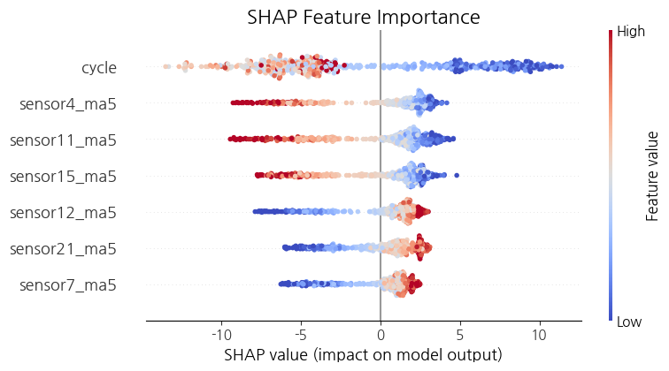
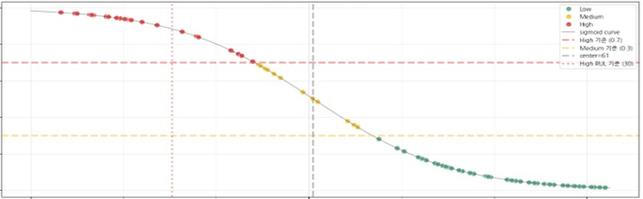
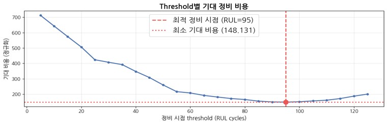

# 🛩️항공기 엔진 RUL예측 및 예지정비 의사결정

다변량 센서 데이터를 활용하여 **항공기 엔진의 잔여 수명(Remaining Useful Life, RUL)** 을 예측하고, 이를 기반으로 **고장 확률 분석 및 최적 유지보수 의사결정**을 수행하는 머신러닝 프로젝트입니다.

항공기 엔진과 같은 고가 장비는 고장이 발생할 경우 운용 중단 비용과 유지보수 비용이 크게 증가합니다.
Predictive Maintenance(예지정비) 관점에서 **데이터 기반 유지보수 전략**을 제안하는 것을 목표로 합니다.

---

## 1. Project Overview
- **주제** : 데이터기반 잔존수명 예측 및 최적의 예지정비 시점 도출
  
- **핵심 목표** 
1. 엔진 센서 데이터를 이용한 **잔여 수명(RUL) 예측 모델 구축**
2. **Failure Probability (고장 확률) 추정**
3. **비용기반 정비 시점 결정 정책(Decision Policy)** 설계

- **데이터셋** : [NASA CMAPSS Turbofan Engine RUL Dataset]([https://www.kaggle.com/competitions/playground-series-s6e1/data](https://www.kaggle.com/datasets/fareselgohary003/nasa-cmapss-turbofan-engine-rul-dataset))

🛠 Tech Stack
- Data Analysis & Stats
  - pandas
  ,numpy
  ,scipy
  ,statsmodels
  ,scikit-posthocs
- Visualization
  - plotly
  ,matplotlib
  ,seaborn
- Machine Learning
  - scikit-learn
  ,randomforest
  ,xgboost
---

## 2. Dataset

- Engine units : **100**
- Operational settings : **3**
- Sensor measurements : **21**
- Total records : **23,010**

### Target Variable

- **Remaining Useful Life (RUL)**

  - RUL = max_cycle - current_cycle
  - 각 엔진이 **고장까지 남은 운용 사이클 수**를 의미합니다.

---

## 3. Project Workflow

### **1. EDA**

- Engine Life Distribution

  - 평균 수명: **206 cycles**
  - 최소: **128 cycles**
  - 최대: **362 cycles**

- Sensor Pattern Analysis

  -  Monotonic Trend Sensors / Constant Sensors (Removed) / Irregular Sensors 

### **2. Feature Engineering**
센서 데이터의 노이즈 제거와 시간 의존성을 반영하기 위해 다음 Feature를 생성했습니다.

Feature들을 추가할 때 마다 baseline 모델의 성능이 개선되었습니다.

- Moving Average (MA)
- Rolling Standard Deviation
- Lag Features
- Difference Features

### **3. RUL Prediction Model**
- 사용 모델

  - Random Forest
  - XGBoost

- 성능 개선

| Model | Setting | RMSE ↓ | MAE ↓ | R² ↑ | 
|------|--------|-------|------|------| 
| Random Forest | Baseline | 15.978 | 10.849 | 0.853 | 
| ⭐ Random Forest | Tuned | **14.406** | **10.117** | **0.881** | 
| XGBoost | Baseline | 16.084 | 10.909 | 0.851 | 
| XGBoost | Tuned | 14.782 | 10.248 | 0.874 | 

**Best Model:** ⭐ Random Forest (Tuned)

- Sharp(Feature importance)

  

    
### **4. Failure Probability Estimation**
RUL 예측 결과를 기반으로 **고장 확률 곡선(Failure Probability)** 을 계산합니다.

고장시점 임박 시 고장확률이 급격히 증가하는 패턴을 반영하기위해 sigmoid함수를 적용했습니다.

- 단순 RUL 예측 → **확률 기반 유지보수 의사결정**

### **5. Decision Policy**
- Failure Probability를 활용하여 비용기반  **최적 정비 시점**을 도출해 예지보수 의사결정 가이드라인을 제시합니다.
  - High risk / Midium risk / Low risk
  - 다운타임 최소화
  - 유지보수 비용 최적화

## 4. Reference

NASA Prognostics Data Repository  

Damage Propagation Modeling for Aircraft Engine Run-to-Failure Simulation  
PHM 2008 Conference

---
## ⭐상세 분석 내용확인

[📄분석보고서](./reports/분석보고서.pdf)
